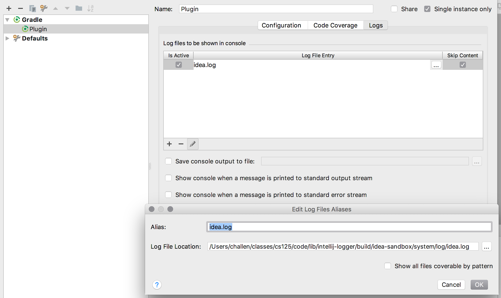

== CS 125 IntelliJ Plugin

This plugin is intended to simplify development for CS 125 students and help us
track their activity and progress.

The plugin was created using the
//
https://www.jetbrains.org/intellij/sdk/docs/tutorials/build_system.html[IntelliJ
Gradle plugin]
//
and is implemented in
//
https://kotlinlang.org/[Kotlin].

=== Usage

Depends on the existence of `.config.yaml` and `.csXYZ` (same as whatever is specified in the `.config.yaml` file.)

=== IntelliJ Plugin Documentation

Please review the
//
https://www.jetbrains.org/intellij/sdk/docs/welcome.html[IntelliJ plugin
development documentation carefully].
//
It is quite comprehensive.

=== Development Environment Setup

The IntelliJ Gradle plugin does an excellent job of setting up your development
environment properly.
//
The "Plugin" run configuration will launch a second copy of IntelliJ IDEA with
the plugin enabled.

It is helpful to be able to view the logs in the original development instance
of IntelliJ.
//
To do this, modify the logs section of the run configuration as follows:

You will need to change the path to the log file created by the testing instance
of IntelliJ.
//
When it is launched, it creates a subdirectory of the build directory to store
its build files separately from the main development copy.
//
That is where you'll find the log file.

=== Useful Examples

Here are a few useful plugins to reference:

. https://github.com/dkandalov/pomodoro-tm[Pomodoro]: good example of a recent
plugin developed in Kotlin.
//
Runs a timer to encourage programmers to take breaks periodically.
//
. https://github.com/wakatime/jetbrains-wakatime[Wakatime]: best example of a
plugin that does almost exactly what we are trying to do.
//
The actions that we instrument are currently borrowed from this plugin.
//
However, it seems to require Python for some reason even on the client, and so
serves only as an example and not as a starting point.

=== Current Status

==== `CS125GradeAction.kt`

This file defines an action that we will eventually use to launch local
autograding when the student clicks on our button.

At this point that linkage is done in `plugin.xml`, but all the action does is
log a message.
//
We need to figure out how to launch a Gradle task at this point.

Note that we should also figure out a way to hide our menu and icons when a
student is working on a non-CS 125 project.
//
That will probably also happen here, but also requires a way to identify CS 125
repositories.

==== `CS125Component.kt`

This file defines what happens on plugin startup.
//
It should register any listeners that we need as well as respond to events, log
data locally, and upload information to the server.

At this point a preliminary set of listeners are set up borrowed from the
Wakatime plugin.
//
The following actions trigger logging messages:

* *document save*: note that this happens asynchronously
//
* *document modifications*
//
* *mouse press*
//
* *visible contents changed*: this is triggered by scrolling and (it seems) by
switching between multiple editor windows

All of these trigger logging the file that was used along with the project.

==== Action counting

Each of the documentation modifications should update one of a set of counters,
which are then saved and cleared regularly by a task triggered by a periodic
timer.

=== TODO

==== State upload and configuration management

Periodically we should post all saved counters to a web endpoint.
//
This also needs to be configured somehow.
//
I wonder if the configuration should live in the project somewhere, so that when
we load a project we search for a configuration, use it if we find it, and
disable the plugin if we don't.
//
This would also make it easier to support multiple courses that might have
different ways of identifying students, want to use different endpoints, and
want to use different icons.

==== Persistent state across IDE restarts

IntelliJ provides a way for plugins to persist state across IDE restarts.
//
We should use this to make sure that we don't lose any data if students work
without a network connection, or if the IDE is closed while there are still some
events that haven't been uploaded yet.

==== Other information to record

We should continue to add events to the things that we record.
//
Extra information could include:

* Use of testing suites
//
* Editor line counts to track development progress
//
* Cut and paste, particularly paste from an external source
//
* Estimates of typing speed
